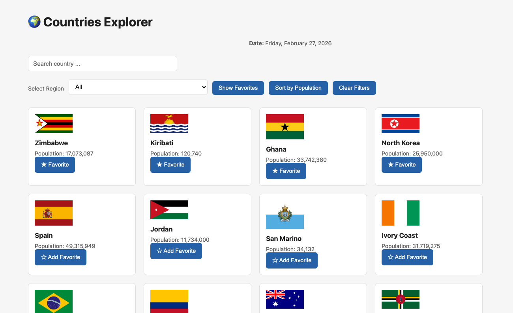
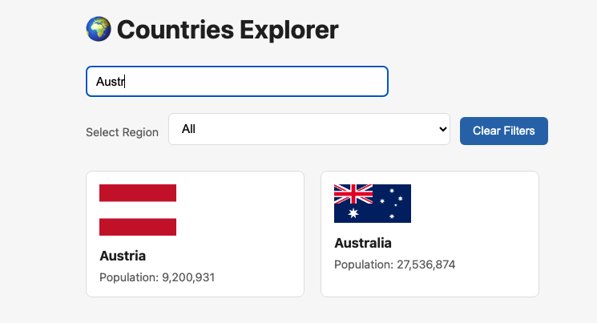

# 🌍 Countries Explorer

A React application that allows users to explore countries from around the world using real data from the REST Countries API.

Users can search for countries by name, filter them by region, and view key details such as population and flag.

---

## 🚀 Features

- Fetches real country data from a public REST API
- Search countries by name (debounced)
- Filter countries by region
- Sort countries by population (high → low)
- Mark countries as favorites (saved in `localStorage`)
- Filter to show only favorite countries
- Clear all filters with one click
- Displays current date
- Loading and error handling
- Safe rendering for missing API fields

---

## 🛠️ Technologies Used

- React (Hooks: `useState`, `useEffect`)
- JavaScript (ES6+)
- REST Countries API
- CSS (custom styling)

---

## 🌐 API Endpoints Used

- **All countries**  
  `https://restcountries.com/v3.1/all`

- **Search by name**  
  `https://restcountries.com/v3.1/name/{name}`

- **Filter by region**  
  `https://restcountries.com/v3.1/region/{region}`

---

## 📦 Installation & Running the App

1. Clone the repository:
   ```bash
   git clone https://github.com/elhamatokhi/Countries-Explorer.git
2. Navigate into the project folder:
   ```bash
    cd countries-explorer
3. Install dependencies:
   ```bash
    npm install
4. Start the development server:
   ```bash
   npm run dev
5. Open your browser and visit:
   ```bash
   http://localhost:5173

## 📸 Filtered result



## Author

👤 **Elhama Tokhi**

- GitHub:[@elhamatokhi](https://github.com/elhamatokhi)

## License

This project is open source and available under the MIT License.
